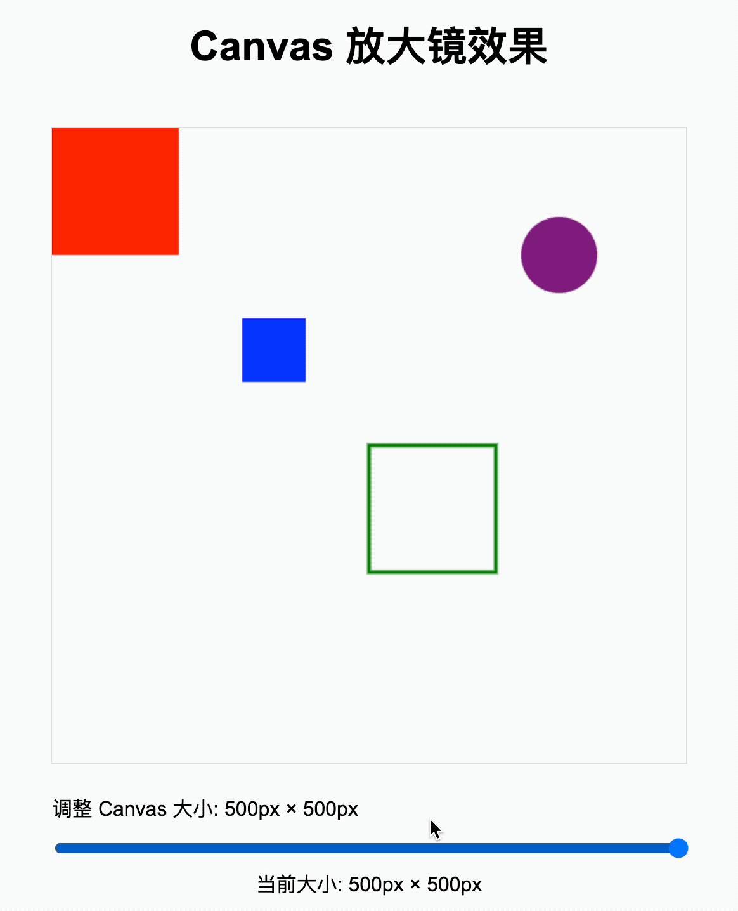

# [0003. 区分 canvas 的 width、height 属性和 style 中设置的 width、height 值](https://github.com/Tdahuyou/TNotes.canvas/tree/main/notes/0003.%20%E5%8C%BA%E5%88%86%20canvas%20%E7%9A%84%20width%E3%80%81height%20%E5%B1%9E%E6%80%A7%E5%92%8C%20style%20%E4%B8%AD%E8%AE%BE%E7%BD%AE%E7%9A%84%20width%E3%80%81height%20%E5%80%BC)

<!-- region:toc -->

- [1. 📝 概述](#1--概述)
- [2. 🤔 为什么推荐直接通过 canvas 的 height、width 属性来设置画布尺寸而非通过 css 的 height、width 来设置呢？](#2--为什么推荐直接通过-canvas-的-heightwidth-属性来设置画布尺寸而非通过-css-的-heightwidth-来设置呢)
- [3. 💻 demos.1 - 对比两种设置画布尺寸的写法](#3--demos1---对比两种设置画布尺寸的写法)
- [4. 💻 demos.2 - 模拟放大镜的效果](#4--demos2---模拟放大镜的效果)

<!-- endregion:toc -->

## 1. 📝 概述

- 🎯 目标
  - 理解下面这两种设置画布尺寸做法的差异

```html
<!-- 【推荐】做法 1：直接通过 canvas 的 width、height 属性设置画布尺寸 -->
<canvas width="400" height="400"></canvas>
```

```html
<!-- 【不推荐】做法 2：通过 CSS 设置画布尺寸 -->
<style>
  #c1 {
    width: 400px;
    height: 400px;
  }
</style>

<canvas id="c1"></canvas>
```

- 🫧 评价
  - canvas 本身是一个元素、是一个盒模型，是一个容器，它也是有尺寸的。
  - 我们知道，设置元素的尺寸可以直接通过 css 的 width、height 属性来实现，但是在 canvas 中，并不推荐使用 css 来设置 canvas 的宽高，而是直接使用 canvas 的 width、height 属性来设置画布的尺寸。
  - 笔记中的大量篇幅在说明两种设置画布尺寸的做法之间的差异。其中，示例 `demos.2` 还利用了这一差异特性，实现了一个“放大镜”的小效果。

## 2. 🤔 为什么推荐直接通过 canvas 的 height、width 属性来设置画布尺寸而非通过 css 的 height、width 来设置呢？

- **style 设置的是容器的尺寸、canvas 的 width、height 设置的是画布坐标系的尺寸。如果两者的尺寸不一致，那么坐标系的最小单位将会自动缩小/放大，以适应容器尺寸。**
- 如果容器是 `400x400` 坐标系是 `200x200`，那么坐标系中的一个单位意味着 `2px`。（放大）
- 如果容器是 `400x400` 坐标系也是 `400x400`，那么坐标系中的一个单位意味着 `1px`。（正常）
- **因此，在设置画布尺寸的时候，为了防止坐标被拉伸，通常都是直接设置 canvas 的 width、height 而不是通过 style 来设置。**

## 3. 💻 demos.1 - 对比两种设置画布尺寸的写法

::: code-group

<<< ./demos/1/1.html [1.html]

<<< ./demos/1/2.html [2.html]

:::

- 1
  - 同时设置了 css 和 canvas 的 width、height
  - 
- 2
  - 只设置 css 的 width、height，忽略 canvas 的 width、height
  - 

## 4. 💻 demos.2 - 模拟放大镜的效果

::: code-group

<<< ./demos/2/1.html [1.html]

:::

- 最终效果：
  - 
- 实现原理：
  - 保持容器尺寸 `css 设置的width、height` 不变，调整 canvas 自身的 width、height。
- 有很多待优化的点，比如：
  - 可以在 `drawContent` 中加入图形绘制起点的偏移量，根据鼠标在容器中的位置来设置缩放的焦点；
  - 也可以再加上鼠标按下和抬起的监听事件，当图像被放大之后，可以拖动图像；
  - ……
