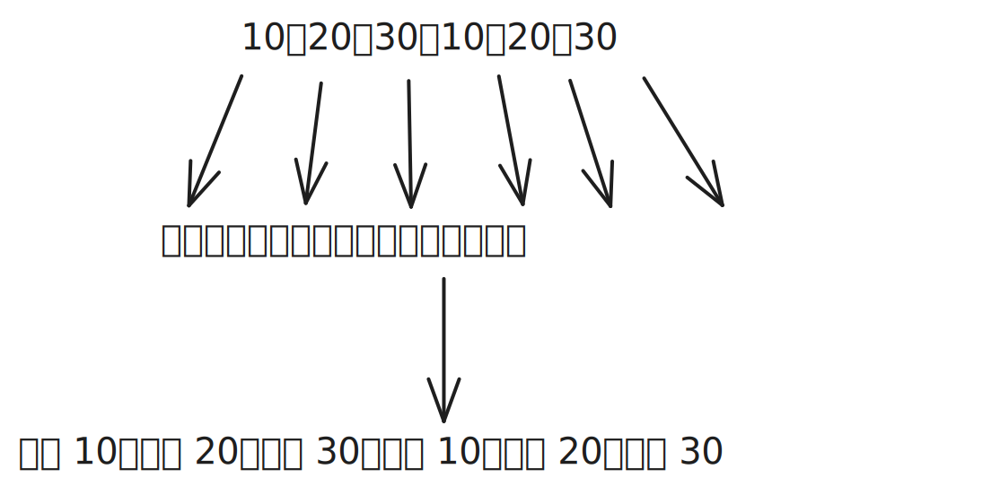

# [0010. 使用 ctx.setLineDash 设置虚线](https://github.com/Tdahuyou/TNotes.canvas/tree/main/notes/0010.%20%E4%BD%BF%E7%94%A8%20ctx.setLineDash%20%E8%AE%BE%E7%BD%AE%E8%99%9A%E7%BA%BF)

<!-- region:toc -->

- [1. 🎯 目标](#1--目标)
- [2. 🫧 评价](#2--评价)
- [3. 📒 `ctx.setLineDash`](#3--ctxsetlinedash)
- [4. 💻 demos.1 - `ctx.setLineDash` 的基本使用](#4--demos1---ctxsetlinedash-的基本使用)

<!-- endregion:toc -->

## 1. 🎯 目标

- 掌握 `ctx.setLineDash` 的基本使用

## 2. 🫧 评价

- `ctx.setLineDash` 使用的核心难点在于理解参数的多种形式，它可以接收任意长度的数字数组，非常灵活，这使得它能绘制出各种类型的虚线。
- 虽然参数可以是任意长度的数字数字，但是绘制虚线的规律其实非常简单，只需要弄清楚每一段线段和空白的长度是如何计算的即可。

## 3. 📒 `ctx.setLineDash`

- `ctx.setLineDash` 可以用来设置虚线，它会根据我们传入的参数数量不同，选择使用不同的行为来设置虚线之间的间隙。
- 不同的模式：
  - 传入一个数，比如 `[50]` 对应虚线：线段 50、空白 50、线段 50、空白 50 ……
  - 传入两个数，比如 `[50, 20]` 对应虚线：线段 50、空白 20、线段 50、空白 20 ……
  - 传入三个数，比如 `[10, 20, 30]` 对应虚线：线段 10、空白 20、线段 30、空白 10、线段 20、空白 30 ……
- 规律：
  - 1️⃣ 传入的数字无限重复
  - 2️⃣ 线段、空白无限重复
  - 1️⃣ ➕ 2️⃣ 合并就是最终绘制的虚线
- 示例：
  - 以 `[10, 20, 30]` 为例：
  - 1️⃣ 10、20、30、10、20、30
  - 2️⃣ 线段、空白、线段、空白、线段、空白
  - 

## 4. 💻 demos.1 - `ctx.setLineDash` 的基本使用

::: code-group

<<< ./demos/1/1.html {16-46}

:::

