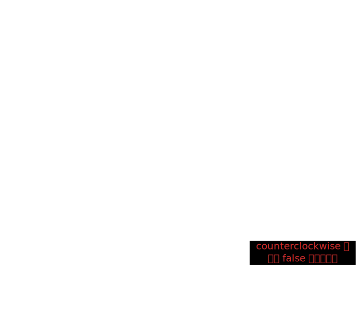

# [0024. 使用 ctx.arc 绘制圆弧](https://github.com/Tdahuyou/TNotes.canvas/tree/main/notes/0024.%20%E4%BD%BF%E7%94%A8%20ctx.arc%20%E7%BB%98%E5%88%B6%E5%9C%86%E5%BC%A7)

<!-- region:toc -->

- [1. 🎯 目标](#1--目标)
- [2. 🫧 评价](#2--评价)
- [3. 📒 角度、弧度](#3--角度弧度)
- [4. 📒 `ctx.arc` 相关参数说明](#4--ctxarc-相关参数说明)
- [5. 💡 圆参考坐标](#5--圆参考坐标)
- [6. 💻 demos.1 - 使用 `ctx.arc` 绘制圆弧](#6--demos1---使用-ctxarc-绘制圆弧)

<!-- endregion:toc -->

## 1. 🎯 目标

- 掌握 `ctx.arc` 的基本使用
- 了解角度和弧度之间的区别，清楚它们俩之间的转换关系

## 2. 🫧 评价

- `ctx.arc` 可以控制圆弧的圆心、起点、终点、半径、方向（正时针、逆时针）等信息，从而实现圆弧的绘制。
- 可以根据文档中提供的图来理解 `ctx.arc` 的绘制原理。

## 3. 📒 角度、弧度

- 角度、弧度
  - 角度和弧度都是用来测量平面角的单位，用于描述角的打开程度。
  - **在绘制圆、弧等曲线图形的时候，使用的单位大多都是弧度，而非角度**。
    - 假如你想要表达 360°，应该传入的参数不是 ~~360~~ 而是 2π 用 JS 代码来表示就是 `2 * Math.PI`。
    - 以此类推，180° 就是 `Math.PI`，90° 就是 `Math.PI / 2`。
  - 其实，你只需要记住 `1° = Math.PI / 180` 这个等式即可，**如果你想要表达 x°，那么可以写 `x * (Math.PI / 180)`。**
  - 上学那会儿，在数学课上绝对是有介绍过这俩之间的转换的，如果忘记了它们是什么，应该如何转换，可以看看文中提供的相关描述和转换公式。
- **角度（Degree）**
  - 角度是衡量平面角大小的一种度量单位，符号通常用 `°` 表示。
  - 一个完整的圆是 360°。
  - 这种划分方式源于古代天文学家的观察，他们发现每年太阳在黄道上移动的角度大约是 360 度（实际上接近 365 天，但 360 是一个方便的数字，因为它能被多个数字整除）。
  - 一些特殊的角度：
    - **直角**：一个直角是 90°，这意味着一个完整的圆由 4 个直角组成。
    - **平角**：平角是 180°，表示两条射线在同一直线上，朝相反方向。
    - **周角**：一个完整的圆角是 360°。
    - ……
- **弧度（Radian）**
  - 弧度是另一种度量角度的方法，它是 **根据角所截取圆弧的长度与圆的半径的比率来定义的**。
  - 在数学和工程学中，弧度是更常用的单位，因为它直接与圆的其他性质（如周长和面积）相关联，且在计算中通常更为简便。
  - 一个弧度定义为圆上一个与半径长度相等的弧所对应的中心角。
  - 一个完整圆的周角为 $(2\pi)$ 弧度，因为一个圆的周长是 $(2\pi r)$（其中 $r$ 是半径），所以当弧长等于半径时，所对应的角就是 1 弧度。因此，$(360^\circ)$ 相当于 $(2\pi)$ 弧度。
- **角度和弧度之间的转换关系是**：

$$
1\ \text{弧度} = \frac{180^\circ}{\pi} \approx 57.2958^\circ
$$

$$
1^\circ = \frac{\pi}{180} \ \text{弧度}
$$

- 使用这些关系，你可以在角度和弧度之间进行转换。
- 例如，90°（一个直角）相当于 `π / 2` 弧度。
- 这种转换在解决涉及三角函数和角度测量的数学、物理问题时非常重要。比如本节介绍的 `ctx.arc` 绘制圆弧，就是用弧度作为单位的。

## 4. 📒 `ctx.arc` 相关参数说明

- `ctx.arc(x, y, radius, startAngle, endAngle, counterclockwise)`
  - `x y radius` 表示圆点坐标、半径。
  - `startAngle` 表示从哪个点开始画。单位是弧度。
  - `endAngle` 表示画到哪个点结束。单位是弧度。
    - `0°` 所在位置：`3` 点钟方向。
    - `90°` 所在位置：`6` 点钟方向。
    - `180°` 所在位置：`9` 点钟方向。
    - `270°` 所在位置：`12` 点钟方向。
  - `counterclockwise` 表示绘制方向。
    - `false` 顺时针（默认）
    - `true` 逆时针

## 5. 💡 圆参考坐标

- 可以结合这张图来辅助理解 `ctx.arc` 绘制圆弧的原理。

## 6. 💻 demos.1 - 使用 `ctx.arc` 绘制圆弧

::: code-group

<<< ./demos/1/1.html {16-49} [1.html]

:::

