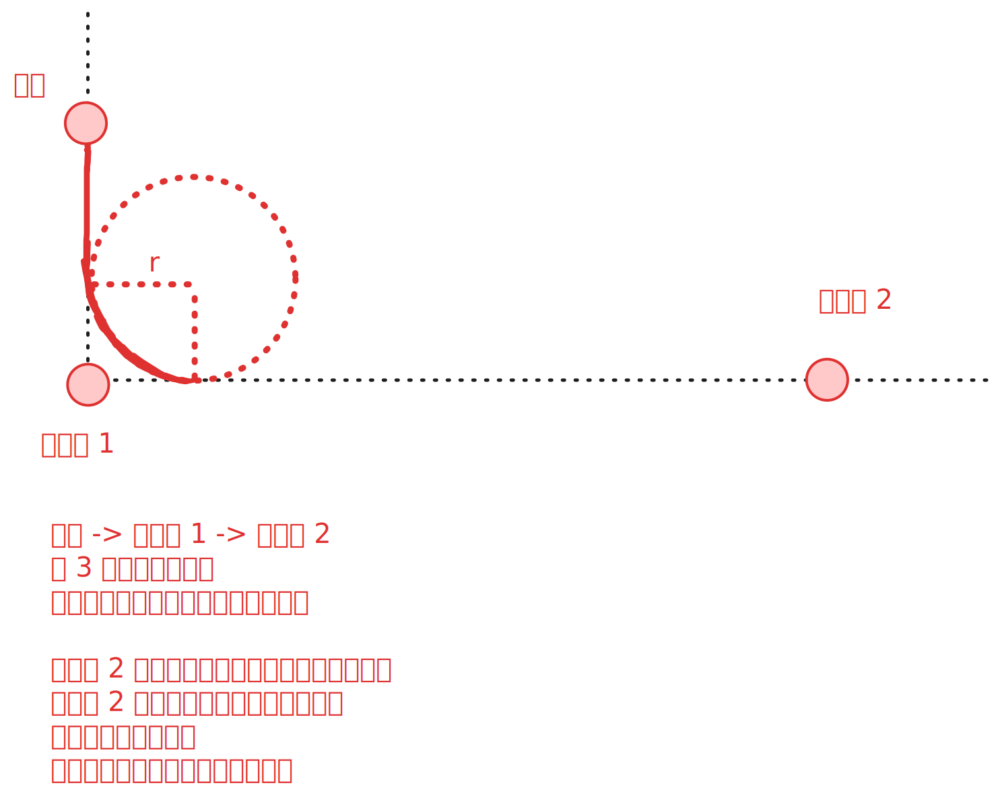

# [0027. ctx.arcTo](https://github.com/tnotesjs/TNotes.canvas/tree/main/notes/0027.%20ctx.arcTo)

<!-- region:toc -->

- [1. 🎯 目标](#1--目标)
- [2. 🫧 评价](#2--评价)
- [3. 📒 `ctx.arcTo`](#3--ctxarcto)
- [4. 💻 demos.1 - 使用 `ctx.arcTo` 绘制圆弧](#4--demos1---使用-ctxarcto-绘制圆弧)

<!-- endregion:toc -->

## 1. 🎯 目标

- 学会使用 `ctx.arcTo` 绘制圆弧。

## 2. 🫧 评价

- `ctx.arc` 和 `ctx.arcTo` 看似很像，实际上用起来差异还是蛮大的。
- 对于 `ctx.arcTo` 绘制的圆弧，它是通过 3 个控制点 + 1 个半径来绘制的。
- 需要注意的是，绘制的弧会从起点开始，但不一定在最后一个控制点结束。

## 3. 📒 `ctx.arcTo`

- 看一张图就明白了。
- 

## 4. 💻 demos.1 - 使用 `ctx.arcTo` 绘制圆弧

::: code-group

<<< ./demos/1/1.html {17-25,28-52} [1.html]

<<< ./demos/1/2.html {17-25,28-42} [2.html]

:::

- 最终效果：

::: swiper

:::

- **注意：**
  - 传入的控制点 2 的坐标，并不代表终点的位置，而仅仅是起到决定圆弧弧度的作用，这一点可以从 `2.html` 看出。
