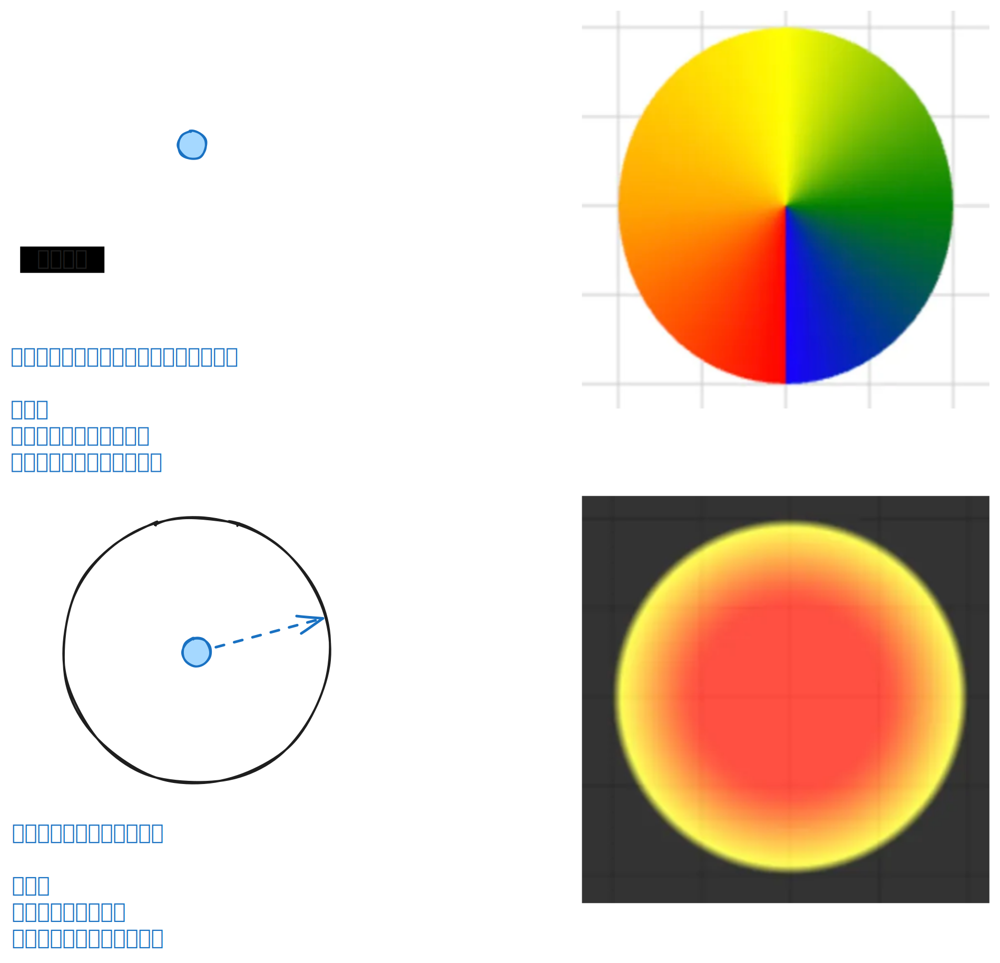

# [0042. 使用 ctx.createRadialGradient 实现径向渐变效果](https://github.com/Tdahuyou/TNotes.canvas/tree/main/notes/0042.%20%E4%BD%BF%E7%94%A8%20ctx.createRadialGradient%20%E5%AE%9E%E7%8E%B0%E5%BE%84%E5%90%91%E6%B8%90%E5%8F%98%E6%95%88%E6%9E%9C)

<!-- region:toc -->

- [1. 🎯 目标](#1--目标)
- [2. 🫧 评价](#2--评价)
- [3. 📒 `ctx.createRadialGradient`](#3--ctxcreateradialgradient)
- [4. 💻 demos.1 - `ctx.createRadialGradient` 的基本使用](#4--demos1---ctxcreateradialgradient-的基本使用)
- [5. 🔗 References](#5--references)

<!-- endregion:toc -->

## 1. 🎯 目标

- 掌握 `ctx.createRadialGradient` 的基本使用

## 2. 🫧 评价

- 镜像渐变 `ctx.createRadialGradient` 的创建非常简单，就是定义俩圆（圆心坐标 + 半斤长度，这意味着需要传入 6 个参数），从圆 1 边缘到圆 2 边缘实现渐变效果。
- 不要把镜像渐变 `ctx.createRadialGradient` 和锥形渐变 `ctx.createConicGradient` 搞错了，要能够区分开两种效果。
- 

## 3. 📒 `ctx.createRadialGradient`

- `ctx.createRadialGradient` 用于创建径向渐变（或称为放射状渐变）。
- `createRadialGradient(x0, y0, r0, x1, y1, r1)`
  - `x0, y0, r0` 圆 1
  - `x1, y1, r1` 圆 2
  - 渐变效果将从圆 1 的边缘开始渐变到圆 2 的边缘。

## 4. 💻 demos.1 - `ctx.createRadialGradient` 的基本使用

::: code-group

<<< ./demos/1/1.html {26-47,58-69} [1.html]

:::

## 5. 🔗 References

- https://developer.mozilla.org/en-US/docs/Web/API/CanvasRenderingContext2D/createRadialGradient
  - MDN - `ctx.createRadialGradient`
