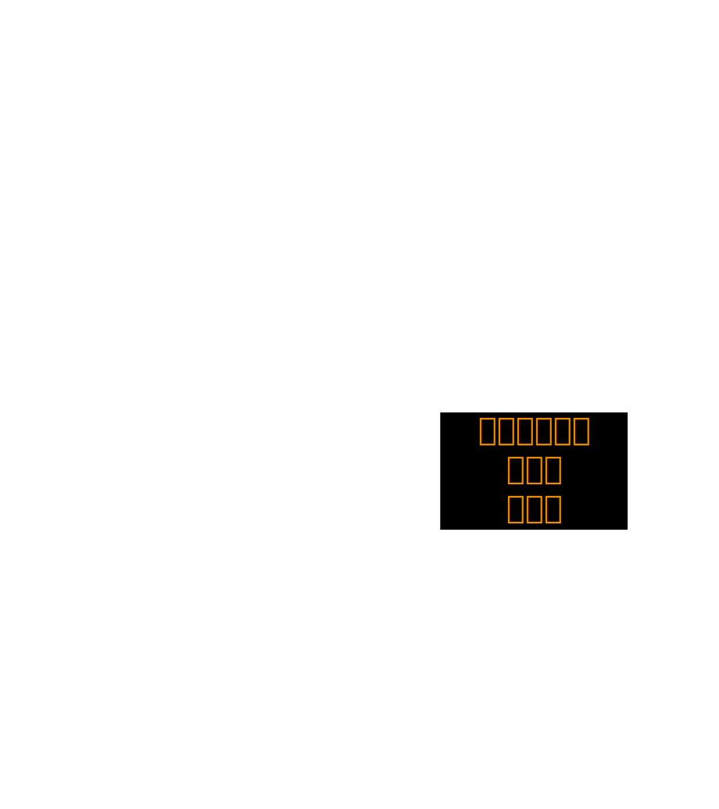

# [0048. ctx.translate](https://github.com/Tdahuyou/TNotes.canvas/tree/main/notes/0048.%20ctx.translate)

<!-- region:toc -->

- [1. 🎯 目标](#1--目标)
- [2. 🫧 评价](#2--评价)
- [3. 📒 `ctx.translate`](#3--ctxtranslate)
- [4. 💻 demos.1 - 坐标偏移](#4--demos1---坐标偏移)
- [5. 💻 demos.2 - 绘制菱形](#5--demos2---绘制菱形)
- [6. 🔗 References](#6--references)

<!-- endregion:toc -->

## 1. 🎯 目标

- 掌握 `ctx.translate` 的基本使用。

## 2. 🫧 评价

- 需要注意的是使用 `ctx.translate` 对坐标进行移动之后，对后续作图的影响。
- `demos.2` 使用 `ctx.rect`、`ctx.fillRect`、`ctx.translate` 绘制出了一个菱形，这算是一种绘制菱形的取巧方案（用 rotate 旋转矩形），可以了解一下这种实现方式的思路。
  - 类似的，对于任何图形（可以通过标准绘图 API 绘制的图形旋转得到的图形），都可以通过类似的方案绘制出来。
  - 在绘制菱形等其它不规则图形的时候，更多情况下会优先使用更加灵活的 `path` 来实现。

## 3. 📒 `ctx.translate`

- `ctx.translate(x, y)`
  - `ctx.translate` 用于移动画布和其原点到一个新的位置，可以通过正负值来控制偏移的方向。
  - `x` 在水平方向上移动的距离。正值向右移动，负值向左移动。
  - `y` 在垂直方向上移动的距离。正值向下移动，负值向上移动。
  - 
- 注意：
  - 这玩意儿移动的是整个坐标系，而非指定的某个图像。
  - 这种变换是对后续的所有画布绘制操作起作用的，而不会影响已经绘制到画布上的内容。

## 4. 💻 demos.1 - 坐标偏移

::: code-group

<<< ./demos/1/1.html {20-34}

<<< ./demos/1/2.html {23}

:::

- `1.html`
  - `ctx.fillRect(0, 0, 100, 100)`
    - 两次绘制矩形使用的位置和尺寸参数都是相同的，但是位置却是不同的。
    - 第一次绘制的“红色”矩形所在的开始位置正好就是 `(0, 0)` 点，也就是坐标偏移前的原始原点。
    - 第二次绘制的时候，坐标系相对位置发生了偏移 `ctx.translate(150, 150)`，这就导致了第二次绘制的“蓝色”矩形的位置也同样发生了偏移。
  - 
- `2.html`
  - `ctx.translate(100, 200)`
    - x 向右偏移 100px
    - y 向下偏移 200px
  - 

## 5. 💻 demos.2 - 绘制菱形

- 需求描述：
  - 画布上有一个正方形，请通过 `ctx.rotate` 旋转，将这个正方形变为菱形。
  - 要求正方形中心位置和旋转后得到的菱形的中心位置是一样的。

::: code-group

<<< ./demos/2/1.html {}

:::

- `ctx.translate` 对画布进行平移，会导致后续绘图时，参考坐标系的变化。
- 比如，`ctx.rotate` 旋转的中心点默认是左上角的原点位置，如果在旋转之前使用了 `ctx.translate` 对画布进行了平移，这将会导致坐标原点发生变化，进而导致 `ctx.rotate` 的旋转中心发生变化。
- 

## 6. 🔗 References

- https://developer.mozilla.org/en-US/docs/Web/API/CanvasRenderingContext2D/translate
  - MDN - CanvasRenderingContext2D：translate() 方法
