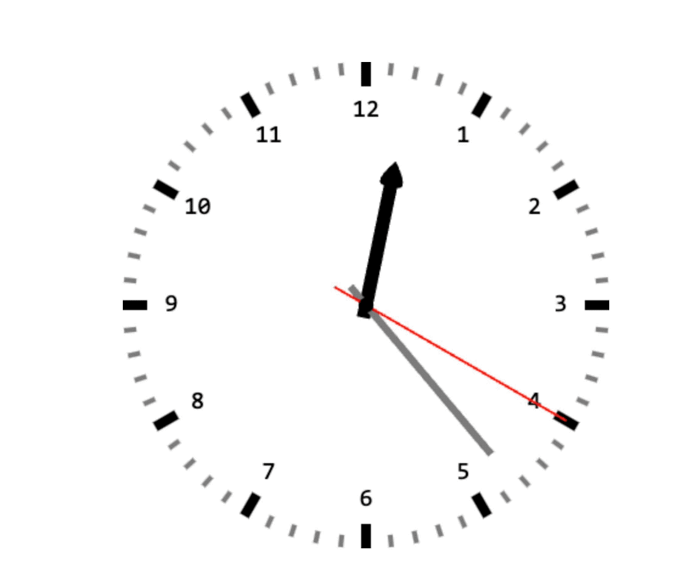

# [0050. 实现动态时钟效果](https://github.com/Tdahuyou/TNotes.canvas/tree/main/notes/0050.%20%E5%AE%9E%E7%8E%B0%E5%8A%A8%E6%80%81%E6%97%B6%E9%92%9F%E6%95%88%E6%9E%9C)

<!-- region:toc -->

- [1. 📝 简介](#1--简介)
- [2. 📒 动态时钟的最终实现效果](#2--动态时钟的最终实现效果)
- [3. 💻 demo - 动态始终效果实现源码](#3--demo---动态始终效果实现源码)

<!-- endregion:toc -->

## 1. 📝 简介

UI 还有很大的优化空间，重点在于理解时钟效果的实现逻辑。

## 2. 📒 动态时钟的最终实现效果



## 3. 💻 demo - 动态始终效果实现源码

```html
<!-- index.html -->
<!DOCTYPE html>
<html lang="en">
  <head>
    <meta charset="UTF-8" />
    <meta http-equiv="X-UA-Compatible" content="IE=edge" />
    <meta name="viewport" content="width=device-width, initial-scale=1.0" />
    <title>Document</title>
    <link rel="stylesheet" href="index.css" />
  </head>
  <body>
    <script src="index.js"></script>
  </body>
</html>
```

```css
/* index.css */
/* 页面垂直居中、水平居中显示 */
canvas {
  /* border: 2px solid #ccc; */
  /* background-color: black; */
  position: absolute;
  left: 50%;
  top: 50%;
  /* 画布大小是 400px * 400px */
  margin-left: -200px;
  margin-top: -200px;
}
```

```js
// index.js
// #region 绘制时钟背景
const clock_bg_canvas = document.createElement('canvas')
document.body.append(clock_bg_canvas)
clock_bg_canvas.width = 400
clock_bg_canvas.height = 400

let ctx = clock_bg_canvas.getContext('2d')

// 移动原点置容器中心
ctx.translate(200, 200)

// #region 绘制时钟的圆盘轮廓
// ctx.save()
// ctx.beginPath()
// ctx.arc(0, 0, 200, 0, Math.PI * 2)
// ctx.stroke()
// ctx.restore()
// #endregion 绘制时钟的圆盘轮廓

// #region 绘制一个黑底的圆
// ctx.arc(0, 0, 200, 0, Math.PI * 2)
// ctx.fill()
// #endregion 绘制一个黑底的圆

// #region 绘制小时刻度
ctx.strokeStyle = 'black'
ctx.lineWidth = 8
for (let i = 0; i < 12; i++) {
  ctx.beginPath()
  ctx.moveTo(0, -200)
  ctx.lineTo(0, -180)
  ctx.stroke()
  ctx.rotate((Math.PI * 2) / 12)
  // 将一圈分为 12 份，每次旋转都是基于上次的位置来旋转的。
  // 一共旋转 12 次，绘制 12 个刻度点。
}
// #endregion 绘制小时刻度

// #region 绘制分钟刻度
// 每个小时刻度之间再绘制 5 个分钟刻度，分别表示 10、20、30、40、50 分。
ctx.strokeStyle = 'gray'
ctx.lineWidth = 4
for (let i = 0; i < 60; i++) {
  if (i % 5 != 0) {
    ctx.beginPath()
    ctx.moveTo(0, -200)
    ctx.lineTo(0, -190)
    ctx.stroke()
  }
  ctx.rotate((Math.PI * 2) / 60)
}
// #endregion 绘制分钟刻度

// #region 绘制小时数字
ctx.font = '20px sans-serif'
ctx.textAlign = 'center'
ctx.textBaseline = 'middle'
ctx.fillStyle = 'balck'
const r = 160
const hd = (Math.PI * 2) / 12
for (let i = 0; i < 12; i++) {
  const text = i == 0 ? 12 : i
  const x = Math.sin(hd * i) * r
  const y = -Math.cos(hd * i) * r
  ctx.fillText(text, x, y)
}
// #endregion 绘制小时数字
// #endregion 绘制时钟背景

// #region 绘制动态的指针
const canvas = document.createElement('canvas')
document.body.append(canvas)
canvas.width = 400
canvas.height = 400
ctx = canvas.getContext('2d')

ctx.translate(200, 200)

start() // 时钟开始转动

function start() {
  ctx.clearRect(-200, -200, canvas.width, canvas.height)
  // 获得当前时间的时分秒，分别计算表针旋转角度
  const now = new Date()
  const hour = now.getHours() % 12
  const minute = now.getMinutes()
  const second = now.getSeconds()

  // #region 绘制时针
  ctx.save()
  ctx.rotate(
    ((hour * 3600 + minute * 60 + second) * Math.PI * 2) / (60 * 60 * 12)
  )
  ctx.beginPath()
  ctx.moveTo(-5, 10)
  ctx.lineTo(-5, -100)
  // 使用贝塞尔曲线绘制一个心形
  ctx.quadraticCurveTo(-15, -100, 0, -120)
  ctx.quadraticCurveTo(15, -100, 5, -100)
  ctx.lineTo(5, 10)
  // ctx.lineTo(5, -100)
  ctx.closePath()
  ctx.stroke()
  ctx.fill()
  ctx.restore()
  // #endregion 绘制时针

  // #region 绘制分针
  ctx.save()
  ctx.rotate(((minute * 60 + second) * Math.PI * 2) / 3600)
  ctx.lineWidth = 6
  ctx.strokeStyle = 'gray'
  ctx.beginPath()
  ctx.moveTo(0, 20)
  ctx.lineTo(0, -160)
  ctx.stroke()
  ctx.restore()
  // #endregion 绘制分针

  // #region 绘制秒针
  ctx.save()
  ctx.rotate(((Math.PI * 2) / 60) * second)
  ctx.lineWidth = 2
  ctx.strokeStyle = 'red'
  ctx.beginPath()
  ctx.moveTo(0, 30)
  ctx.lineTo(0, -190)
  ctx.stroke()
  ctx.restore()
  // #endregion 绘制秒针

  // #region 绘制圆心点
  ctx.save()
  ctx.beginPath()
  ctx.arc(0, 0, 6, 0, Math.PI * 2)
  ctx.fill()
  ctx.restore()
  // #endregion 绘制圆心点

  setTimeout(start, 1000) // 每秒更新一次
}
// #endregion 绘制动态的指针
```

**脚本分为两个部分：**
1. 静态部分：绘制时钟背景，这一部分主要就是绘制时钟背景所需要的各个组件。
2. 动态部分：绘制动态的指针，这一部分主要通过 js 来控制 3 个指针的转向，每秒更新一次。


